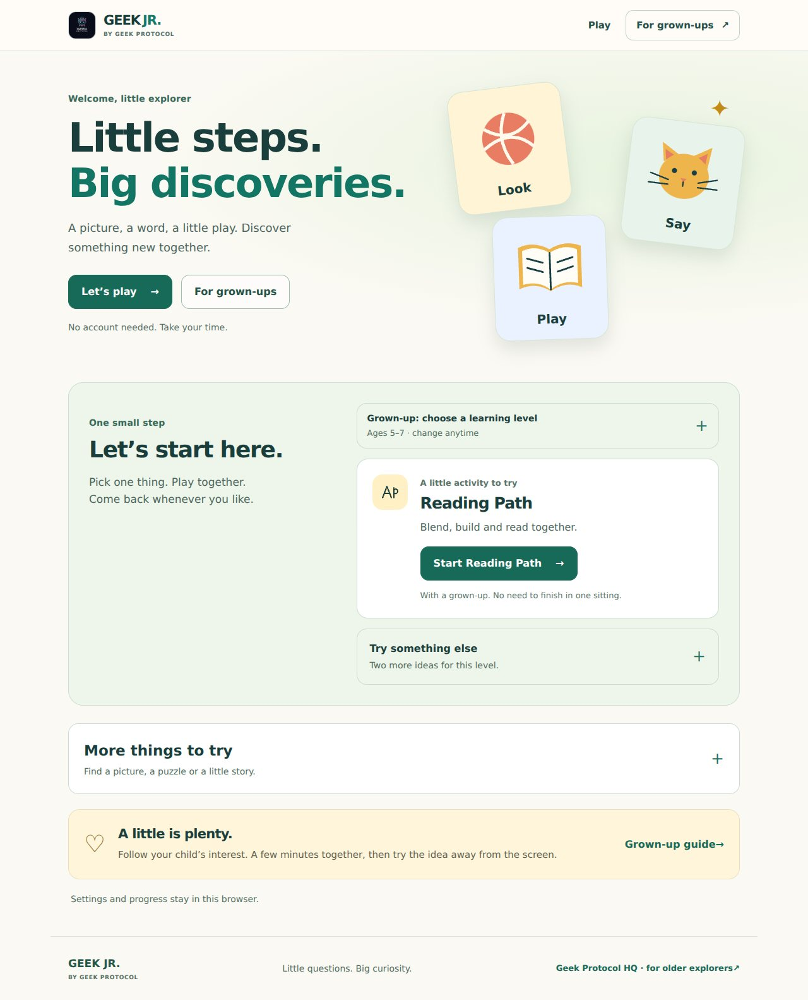
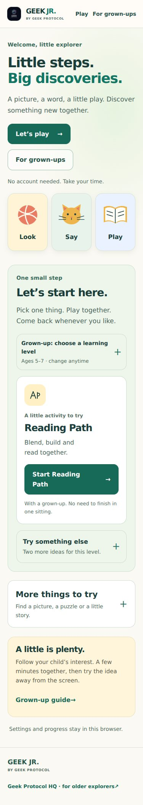
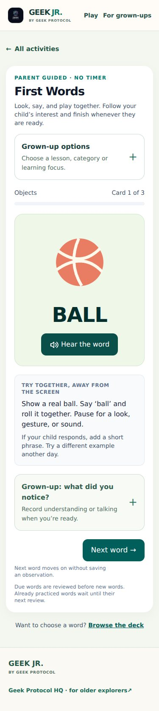
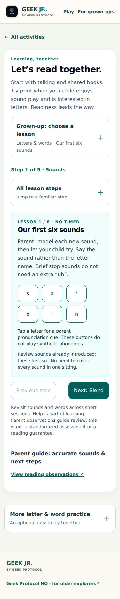
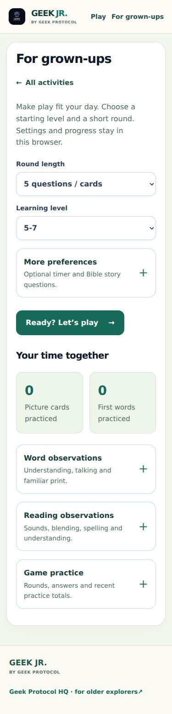

# A calmer Geek Jr

Geek Jr now starts with one suggested activity for the selected age range. Two alternatives and the six-activity library open when wanted. Warm colors, illustrated word cards, consistent activity icons, larger controls, and shorter navigation make the first choice easier to find.

First Words keeps the illustrated card and a **Next word** action prominent. Lesson settings and parent observations open separately. Moving on without saving records no observation. Reading Path shows the current step and its next action, with lesson selection and step shortcuts available on demand. The **For grown-ups** page leads with learning level and round length; optional preferences and detailed records are collapsible. Links to records open the correct panel, including after reload.

All existing storage keys, practice intervals, quiz scoring, content, and parent observation rules remain in use. The existing default age level remains 5–7; families can change it on the home page or parent page.

## Validation

- `npm run check:content`
- `npm run lint`
- `GITHUB_PAGES=true GEEK_JR_CUSTOM_DOMAIN=geekjr.xyz npm run build`
- `git diff --check`
- Chromium against the actual static export, with real client navigation and browser storage: all nine pages at 320, 375, 768, and 1280 pixels; no horizontal overflow, missing local resources, or browser errors.
- Same-page and cross-route activity links, direct record links, reload, keyboard disclosure, and all four persisted age recommendations.
- Toddler matching completion/restart without a timer; word exploration without fabricated observations; explicit observation save/reload; print focus hides pictures and spoken hints block independent marks.
- Picture Cards reveal/practice storage; parent preference persistence; reading sounds, blending, letter building, connected text, help gating and observation save; three-question game completion and first-try summary.

This checks the interface and existing practice rules, not learning outcomes or real-device voice quality. Browser speech depends on device voice availability. No new dependency, account requirement, tracking, or content collection is added.

## Screenshots

### Home, desktop

### Home, phone

### First Words, phone

### Reading Path, phone

### For grown-ups, phone

